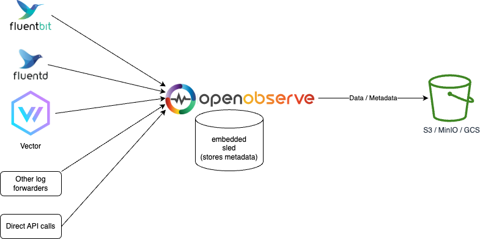
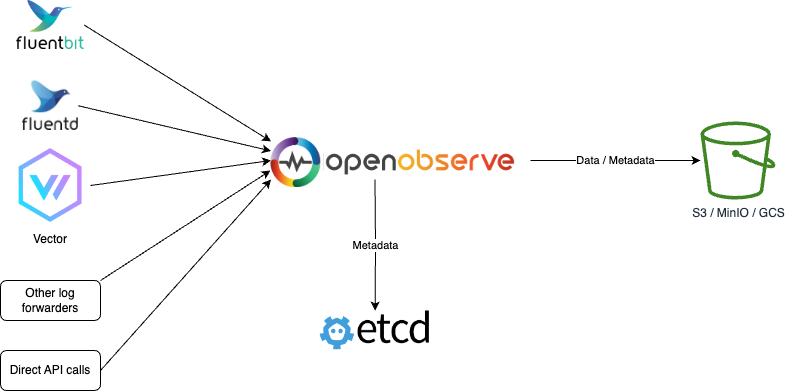
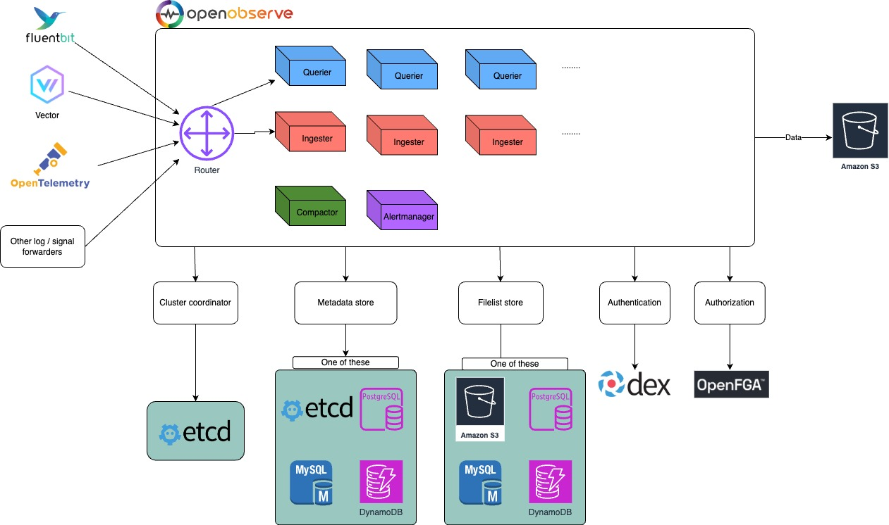

> Applicable to open source & enterprise version
# Architecture and deployment modes

OpenObserve can be run in single node or in HA mode in a cluster. 

## Single Node

Please refer to [quickstart](./quickstart.md) for single node deployments.

### Sled and Local disk

Use this mode for light usage and testing or if HA is not a requirement for you. (You could still ingest and search over 2 TB on a single machine per day. On a mac M2 in our tests, you can ingest at ~31 MB/Second or 1.8 GB/Min or 2.6 TB/Day with default configuration). This is the default mode for running OpenObserve. Check [Quickstart](./quickstart.md) to find various ways to get this setup done.

### Sled and Object storage

### etcd and object storage

## High Availability (HA) mode

Local disk storage is not supported in HA mode. Please refer to [HA Deployment](./ha_deployment.md) for cluster mode deployment.

### etcd and object storage

Router, Querier and Ingester nodes can be horizontally scaled to accommodate for higher traffic.

Etcd is used to store metadata like organization, users, functions, alert rules and cluster node information.

Object Storage (e.g. s3, minio, gcs, etc...) stores all the data of parquet files and file list index.

## Durability

Astute users may notice that, on ingesters data is stored temporarily for batching before being sent to highly durable s3 (s3 is designed for 99.999999999% durability). There is only 1 copy of the data temporarily on the ingester and it may seem that this lends data to be vulnerable to loss in case of the disk failure before it is sent to s3. That is not entirely true though and there are ways to handle the lack of redundancy here. Most distributed systems that have been built in past were built in an era where storage was much less reliable than it is today and you would make 2-3 copies to ensure that you do not loose data. 

In addition to that, in environments like AWS replicating data across multiple availability zones results in the penalty of cross AZ data transfer (2 cents per GB - 1 cent in each direction). In fact Amazon EBS volumes are already replicated within an AZ providing you with a highly durable storage. Standard GP3 EBS volumes provide 99.8% durability which is very high compared to regular disks. io2 volumes that OpenObserve team uses for its cloud service provides 99.999% durability which is even higher and at this level you don't really need to make multiple copies for durability.

For self hosted scenarios we recommend to use RAID-1 to ensure that you have redundancy at the disk level.

By choosing to build the system this way we are able to build a much more cost effective and simpler solution without having to manage ongoing replication of data across multiple nodes and the costs (money and complexity) associated with it.

## Components

### Ingester

Ingester is used to receive ingest request and convert data into parquet format and store it in object storage. They store data temporarily in WAL before transferring it to object storage.

The data ingestion flow is:

1. receive data from http API request.
1. parse line by line.
1. check if there are some functions (ingest time functions) used to transform data. will call each ingest function by the function order. like `func(row)` and will expect to return a row. if empty row is returned then it will drop the record.
1. check timestamp field, convert timestamp, and set current timestamp if there is no time field.
1. check stream schema to identify if schema needs to be evolved.
1. write to WAL file by timestamp in hourly buckets.
1. when max file size or the time is reached, it will convert WAL file to parquet file and move to storage(local or s3). e.g max_file_size=10MB, max_time=10 minutes, then if the file size reaches 10 MB or elapsed time is 10 minutes whichever occurs first, the file will be moved to object storage.
1. Ingester also does the work of evaluating any real time alerts that have been defined.

### Querier

Querier is used to query data. Queriers nodes are fully stateless.

The data query flow is:

1. receive search request from http API. The node that receives the query request is called `LEADER querier for the query`. Other queriers are called `WORKER queriers for that query`.
1. `LEADER` parses and verifies SQL.
1. `LEADER` finds the data time range and get file list from file list index.
1. `LEADER` fetch querier nodes from cluster metadata.
1. `LEADER` partitions list of files to be queried by each querier. e.g. If 100 files need to be queried and there are 5 nodes, then each querier gets to query 20 files `LEADER` works on 20 files, `WORKERS` work on 20 files each.
1. `LEADER` calls gRPC service running on each `WORKER` querier to dispatch search query to the querier node. Inter querier communication happens using gRPC.
1. `LEADER` collects, merges and sends the result back to the user.

Tips:

1. The querier will cache parquet files in memory by default. You can configure the amount of memory used by querier for caching through environment variable `ZO_MEMORY_CACHE_MAX_SIZE`.  Default caching is done through 50% of the memory available to the particular querier.
1. In distributed environment each querier node will just cache a part of the data.
1. We also have an option to enable caching latest parquet files in memory. The ingester will send a notice to queriers to cache the files when ingester generates a new parquet file and sends it to object storage.

### Compactor

Compactor will merge small files into a big file to make the search more efficient. Compactor also handles the data retention policy, full stream deletion and update of file list index.

### Router

Router dispatches requests to ingester or querier. It also responds with the GUI in the browser. Router is a super simple proxy to send appropriate requests between ingester and querier.

### AlertManager

AlertManager runs the Standar alert queries and sends notification.
