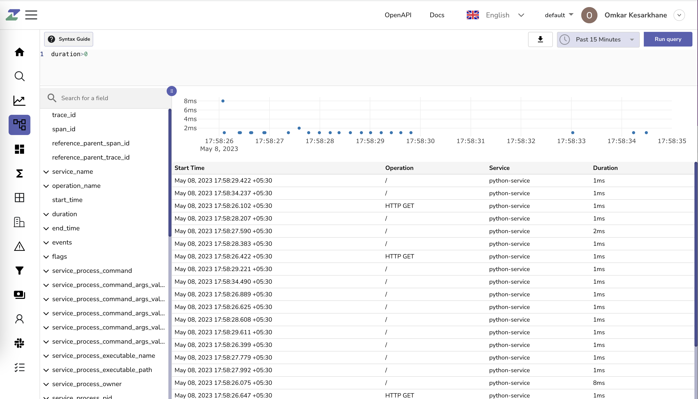
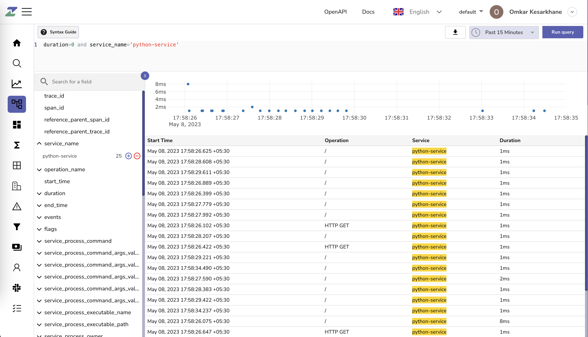

# Python

You can setup tracing for your Python application. Check sample configuration on how to setup traces.

##Clone 

```

git clone https://github.com/zinclabs/sample-tracing-python

```

If you don't have Python3 installed, please install it and then follow below steps.

Open `tracing.py` file from that repository.
```python linenums="1" hl_lines="17 18"

from opentelemetry import trace
from opentelemetry.sdk.trace import TracerProvider
from opentelemetry.sdk.resources import SERVICE_NAME, Resource
from opentelemetry.sdk.trace.export import BatchSpanProcessor
from opentelemetry.exporter.otlp.proto.http.trace_exporter import OTLPSpanExporter


# Service name is required for most backends
resource = Resource(attributes={
    SERVICE_NAME: "python-service"
})

# create a tracer provider
tracer_provider = TracerProvider(resource=resource)

# create an OTLP trace exporter
url = 'HTTP_Endpoint'
headers = {"Authorization": "Authorization"}

exporter = OTLPSpanExporter(endpoint=url, headers=headers)

# create a span processor to send spans to the exporter
span_processor = BatchSpanProcessor(exporter)

# add the span processor to the tracer provider
tracer_provider.add_span_processor(span_processor)

# set the tracer provider as the global provider
trace.set_tracer_provider(tracer_provider)

```
##Setup up credentials 

You will get `url` and `Authorization` key here [http://observe.zinc.dev/ingestion/traces/](http://observe.zinc.dev/ingestion/traces/)

Replace the `url` and `Authorization` key in the `tracing.py` file

##Setup Service/Application 
Follow the steps given in the sample-tracing-python readme and then start server
```
python3 app.py
```
The server is now running, navigate to [http://127.0.0.1:5000](http://127.0.0.1:5000)

Refresh page couple of times to get more traces exported.


Traces are captured, you can check these captured traces here [https://observe.zinc.dev/traces](https://observe.zinc.dev/traces)



Filter traces with your service name `python-service`


