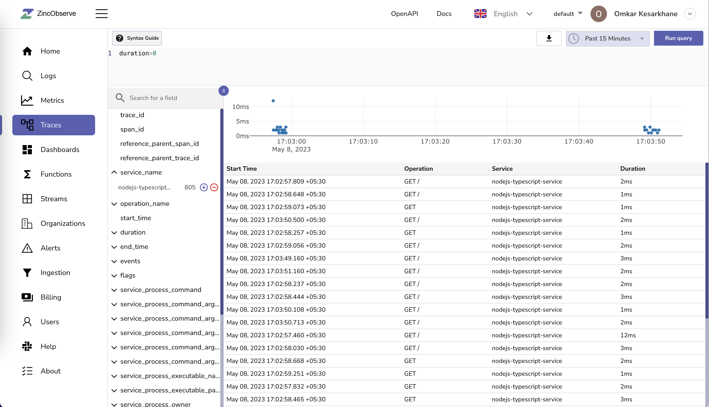
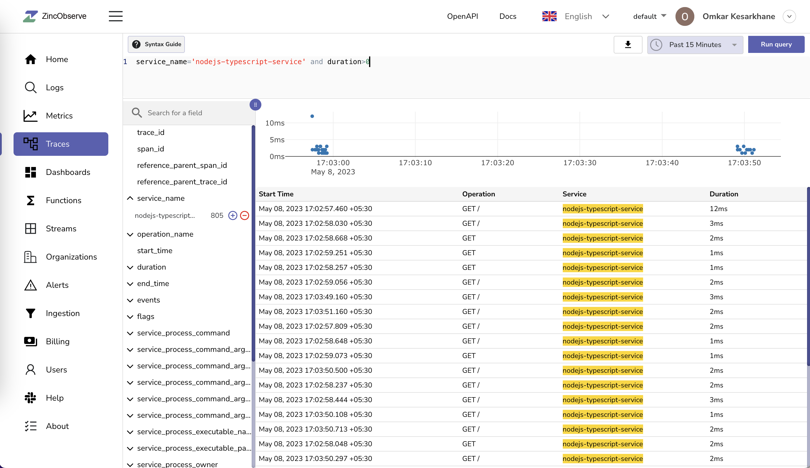
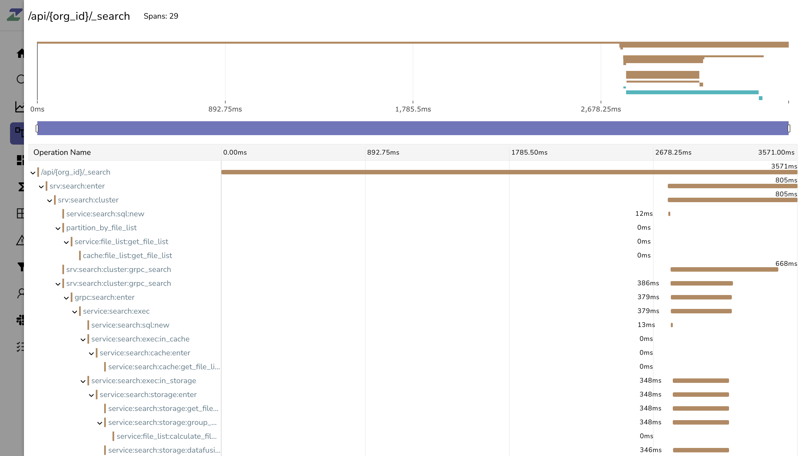

# Typescript

You can setup tracing for your Node.js Typescript application. Check sample configuration on how to setup traces.

##Clone </br>
```

git clone https://github.com/zinclabs/sample-tracing-nodejs-typescript

```

If you don't have node.js installed, please install it and then follow below steps.

Open `tracing.ts` file from that repository.
```typescript linenums="1" hl_lines="13 15"

import  *  as  opentelemetry  from  "@opentelemetry/sdk-node";
import { getNodeAutoInstrumentations } from  "@opentelemetry/auto-instrumentations-node";
import { diag, DiagConsoleLogger, DiagLogLevel } from  "@opentelemetry/api";
import { OTLPTraceExporter } from  "@opentelemetry/exporter-trace-otlp-http";

// For troubleshooting, set the log level to DiagLogLevel.DEBUG

diag.setLogger(new  DiagConsoleLogger(), DiagLogLevel.INFO);

const  sdk = new  opentelemetry.NodeSDK({
    // traceExporter: new opentelemetry.tracing.ConsoleSpanExporter(),
    traceExporter:  new  OTLPTraceExporter({
        url: "https://api.zinc.dev/api/default/traces",
        headers: {
            Authorization: "Authorization",
        },
    }),
    instrumentations: [getNodeAutoInstrumentations()],
    serviceName:  "nodejs-typescript-service",
});

sdk.start();
```
</br>
##Setup up credentials </br>

You will get `url` and `Authorization` key here [http://observe.zinc.dev/ingestion/traces/](http://observe.zinc.dev/ingestion/traces/)

Replace the `url` and `Authorization` key in the `tracing.js` file

##Setup Service/Application </br>

Follow the steps given in the sample-tracing-nodejs-typescript readme and then start server

```
    node --require './tracing.js' app.js
```
The server is now running on 8080, navigate to [http://localhost:8080](http://localhost:8080) </br>
Refresh page couple of times to get more traces exported.


</br>
</br>

Traces are captured, you can check these captured traces here [https://observe.zinc.dev/traces](https://observe.zinc.dev/traces)
</br>


</br>
</br>

Filter traces with your service name `nodejs-typescript-service`
</br>



Click on any trace to check trace data.



Trace can have multiple spans, each span represents single operation or task within that trace. Click on any span to check span details.


