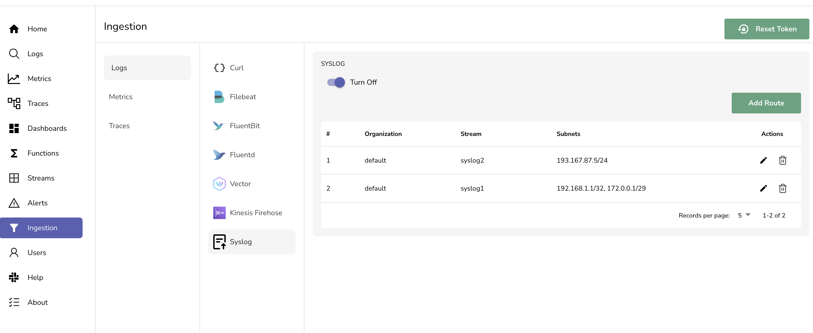

# Syslog server

ZincObserve can act as a syslog server. This means that you can send logs to ZincObserve using the syslog protocol. ZincObserve supports both UDP and TCP syslog.

## Enable syslog

Before you can send logs to ZincObserve, you need to enable ZincObserve to act as a syslog server. This is done by enabling syslog in the `Ingestion > Logs > Syslog` section of the ZincObserve UI.

[](./images/syslog.png)

## Subnets to allow traffic from

ZincObserve will only accept syslog traffic from the subnets that you specify. You must specify a minimum of 3 things:

- Organization
- Stream name 
- Subnets

## Configuration

Default port: `5514`

You can change the default port number using the following environment variables:

* `ZO_TCP_PORT` - TCP port number to listen on. Default: `5514`
* `ZO_UDP_PORT` - TCP port number to listen on. Default: `5514`


## Testing

Select an organization and stream. Then set the subnet to `0.0.0.0.0/0`. This config allows accepting syslog data from any IP address.

You can then use the syslog generator script from [this repo](https://github.com/zinclabs/syslog_log_generator) to test if you are able to accept syslog data in ZincObserve.

Steps:

### Clone the repo

``` shell
git clone https://github.com/zinclabs/syslog_log_generator
cd syslog_log_generator
```

### Modify the script 

file `generate_logs.sh`

```shell
#!/bin/sh
python syslog_gen.py --host 127.0.0.1 --port 5514 --file sample_logs.txt --count 100000
```

Modift the file with the appropriate IP address.

### Start generating test syslog data

```shell
./generate_logs.sh
```


