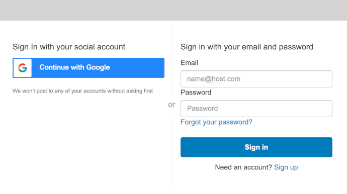
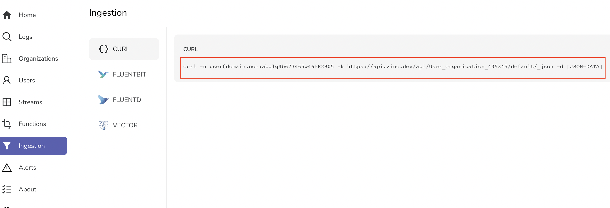
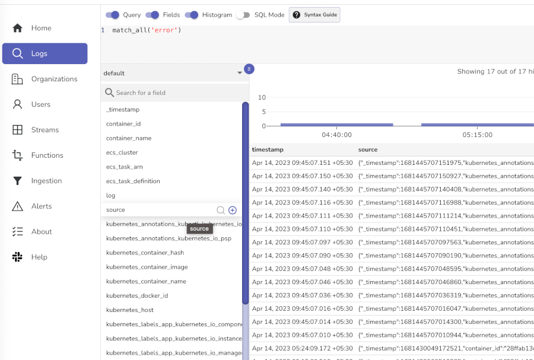

# Quickstart

You can get started with [OpenObserve Cloud](https://cloud.openobserve.ai) or a self hosted installation. 

OpenObserve Cloud is recommended for most users due to following benefits:

1. No effort in setting up a `Highly Available` installation and maintaining it.
1. OpenObserve Cloud with its generous free tier is quite a lot for most hobby users / smaller companies / startups.
1. Newer features and bug fixes are available earlier in OpenObserve Cloud. 
1. And more...

## OpenObserve Cloud

OpenObserve Cloud is offered as a hosted service backed by open source OpenObserve. It has the same features as that of OpenObserve with generous free tier with no effort on maintaining infrastructure for your own cluster.

Let's go through it.

1. Navigate to [https://cloud.openobserve.ai](https://cloud.openobserve.ai)
2. Use a social login or create an account using email / password

3. Now head over to `Ingestion` section and grab `CURL` command


Now head over to [Load sample data](#load-sample-data) section


## Self hosted Installation

**Note**: Installation directions on this page is for single node installations. If you are looking for a `Highly Available` installation then head over to [HA deployment](/ha_deployment) section.

You would need ZO_ROOT_USER_EMAIL and ZO_ROOT_USER_PASSWORD environment variables when you start OpenObserve for the first time. You don't need them on subsequent runs of OpenObserve.

=== "Windows"

    Binaries can be downloaded from [releases](https://github.com/zinclabs/openobserve/releases) page for appropriate platform.


        set ZO_ROOT_USER_EMAIL=root@example.com
        set ZO_ROOT_USER_PASSWORD=Complexpass#123
        openobserve.exe


    Now point your browser to [http://localhost:5080](http://localhost:5080) and login

=== "MacOS/Linux Binaries"
    Binaries can be downloaded from [releases](https://github.com/zinclabs/openobserve/releases) page for appropriate platform.

        ZO_ROOT_USER_EMAIL=root@example.com ZO_ROOT_USER_PASSWORD=Complexpass#123 ./openobserve


    Now point your browser to [http://localhost:5080](http://localhost:5080) and login

    **Getting glibc error running binary**

    ```shell
    ./openobserve: `/lib/libm.so.6`: version `GLIBC_2.27` not found (required by ./openobserve)
    ```

    > Download the `musl` binary instead of regular binary from [releases](https://github.com/zinclabs/openobserve/releases) page that has no external dependencies. This binary is not as performant as other binaries though. We recommend running the containerized version if performance is a concern for you and are unable to make the dependencies work.

=== "Docker"

    Docker images are available at [https://gallery.ecr.aws/zinclabs/openobserve](https://gallery.ecr.aws/zinclabs/openobserve)

        mkdir data
        docker run -v $PWD/data:/data -e ZO_DATA_DIR="/data" -p 5080:5080 \
            -e ZO_ROOT_USER_EMAIL=root@example.com -e ZO_ROOT_USER_PASSWORD=Complexpass#123 \
            public.ecr.aws/zinclabs/openobserve:latest


    Now point your browser to [http://localhost:5080](http://localhost:5080) and login

    **Error pulling image if you have AWS CLI installed?**

    If you have AWS CLI installed and get login error then run below command:

        aws ecr-public get-login-password --region us-east-1 | docker login --username AWS --password-stdin public.ecr.aws

    
    *** Docker tags ***

    - `public.ecr.aws/zinclabs/openobserve:latest`

        Compatible with environments of most users

    - `public.ecr.aws/zinclabs/openobserve:latest-simd`

        If you want to leverage OpenObserve's support for vectorization then you should use this image. OpenObserve supports `AVX512` on intel CPUs, or `NEON` on ARM CPUs. This will help you get higher performance.

=== "Kubernetes - Manifest"

    Create a namespace:

        kubectl create ns openobserve

    Create the deployment and port forward:

        kubectl apply -f https://raw.githubusercontent.com/zinclabs/openobserve/main/deploy/k8s/statefulset.yaml

    Expose the openobserve service by port-forwarding:

        kubectl -n openobserve port-forward svc/openobserve 5080:5080

    Now point your browser to [http://localhost:5080](http://localhost:5080) and login

## Load sample data

We will use JSON API to load sample log data.

Below commands will download a sample file of real life log data, unzip it and load it in OpenObserve using the JSON ingestion API.

**Download sample data**

```shell
curl -L https://zinc-public-data.s3.us-west-2.amazonaws.com/zinc-enl/sample-k8s-logs/k8slog_json.json.zip -o k8slog_json.json.zip
unzip k8slog_json.json.zip
```

**Load sample data**

*Note*: Replace the URL you got from OpenObserve Cloud and append it with `@k8slog_json.json`

```shell title="For OpenObserve Cloud"
curl -u user@domain.com:abqlg4b673465w46hR2905 -k https://api.openobserve.ai/api/User_organization_435345/default/_json -d "@k8slog_json.json"
```

```shell title="For self hosted installation"
curl http://localhost:5080/api/default/default/_json -i -u root@example.com:Complexpass#123  -d "@k8slog_json.json"
```


## Search for data

Point your browser to [http://cloud.openobserve.ai](http://cloud.openobserve.ai) (for OpenObserve Cloud) / [http://localhost:5080](http://localhost:5080) (for self hosted) and login

1. Visit `logs` page
1. Select the index `default` from drop down in the left

1. Type `match_all('error')` in search bar and click the search button on right.

Click on the "syntax guide" button next to the search bar to see examples on how to search.

