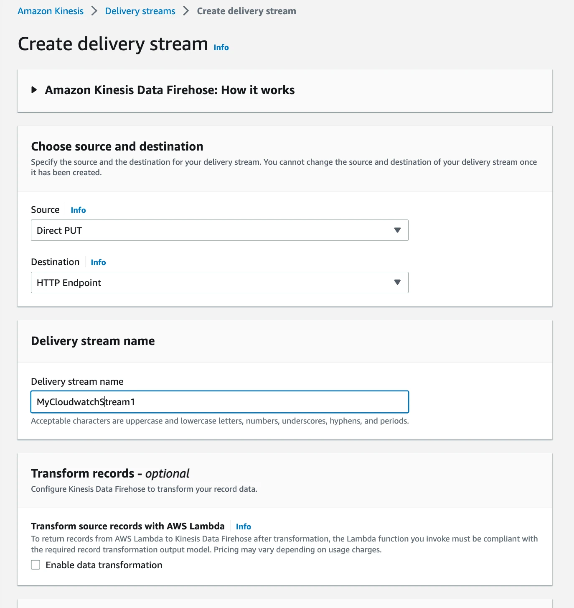
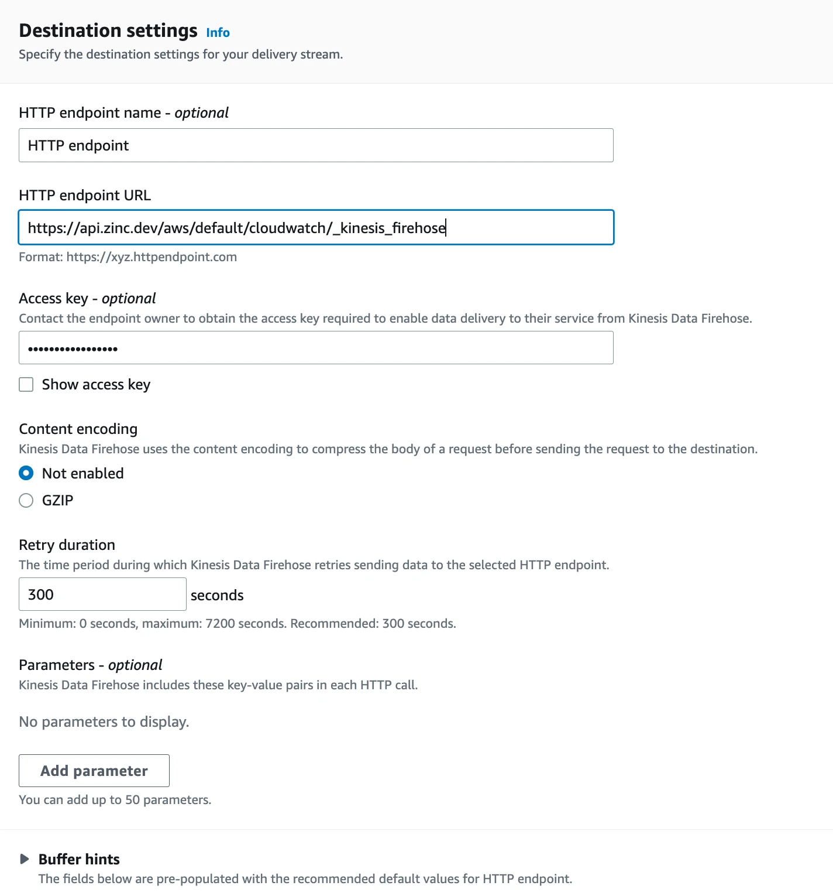
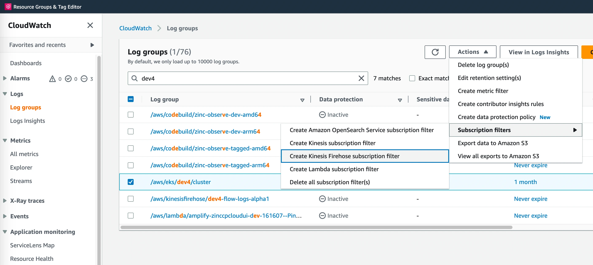
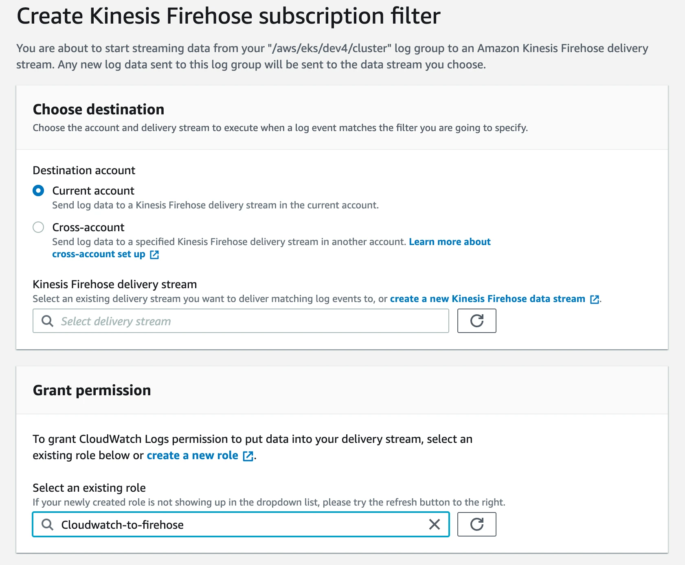
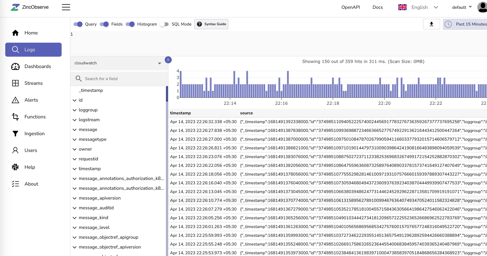

# Ingest Amazon Cloudwatch logs in OpenObserve

## Introduction

OpenObserve can be utilized to analyze and search Cloudwatch logs which are used by most AWS services. If you wish to send your log data to OpenObserve, we recommend that you use Cloudwatch subscription filters together with Kinesis Firehose. Rest of this guide takes you through a step-by-step process on how to do it.

> You can either use a self hosted OpenObserve or [OpenObserve Cloud](https://cloud.openobserve.ai) for following this guide. You can get started with [OpenObserve Cloud](https://cloud.openobserve.ai) for free at [https://cloud.openobserve.ai](https://cloud.openobserve.ai) that has a generous free tier.

Below are the steps that you can follow:

1. Get OpenObserve Cloud / OpenObserve credentials
1. Configure Kinesis Firehose
1. Set up IAM policy and role for Cloudwatch to send logs to Kinesis Firehose
1. Set up Cloudwatch subscription filter to send logs to Kinesis Firehose
1. Monitor and Analyze Cloudwatch Logs in OpenObserve

## Step 1: Get OpenObserve Cloud / OpenObserve credentials

Navigate to `Ingestion > Kinesis Firehose`


Credentials obtained here will be used in next step to configure Kinesis Firehose.

## Step 2: Configure Kinesis firehose

1. Log in to AWS console.
1. Go to Kinesis Firehose
1. Click `Create delivery stream`
1. Choose source - `Direct PUT` and Destination - `HTTP Endpoint`

1. Give it the name `MyCloudwatchStream1`
1. Enter the HTTP endpoint URL (What you got from `Step 1`)
    1. `https://api.openobserve.ai/aws/orgname/streamname/_kinesis_firehose` if you are using OpenObserve Cloud.
    1. `https://yourdomain.com/aws/orgname/streamname/_kinesis_firehose` if you are hosting a OpenObserve installation yourself. Remember that if you are self hosting OpenObserve then your endpoint must be a publicly accessible HTTPS endpoint in order for Kinesis Firehose to send the data, 
1. You will also need to enter the `access key` that you got from `Step 1`. We will change the name of the stream to `cloudwatch` so we have a dedicated stream.

1. Click `Create delivery stream` to complete the setup.

## Step 3: Setup IAM policy and role

We will be creating an IAM policy and role to be used by Cloudwatch to send logs to Kinesis Firehose

1. Create an IAM policy by going to `IAM > Policies > Create policy`

```json linenums="1"
{
    "Version": "2012-10-17",
    "Statement": [
        {
            "Sid": "VisualEditor0",
            "Effect": "Allow",
            "Action": [
                "firehose:DescribeDeliveryStream",
                "firehose:PutRecordBatch"
            ],
            "Resource": "*"
        }
    ]
}
```


1. Give the policy a name `cloudwatch_firehose`
2. Create an IAM Role by going to `IAM > Roles > Create role`
3. Select Custom trust policy and paste the following:

```json linenums="1"
{
    "Version": "2012-10-17",
    "Statement": [
        {
            "Sid": "Statement1",
            "Effect": "Allow",
            "Principal": {
                "Service": "cloudwatch.amazonaws.com"
            },
            "Action": "sts:AssumeRole"
        },
        {
            "Sid": "Statement2",
            "Effect": "Allow",
            "Principal": {
                "Service": "delivery.logs.amazonaws.com"
            },
            "Action": "sts:AssumeRole"
        },
        {
            "Sid": "Statement3",
            "Effect": "Allow",
            "Principal": {
                "Service": "logs.amazonaws.com"
            },
            "Action": "sts:AssumeRole"
        }
    ]
}
```

4. Select the policy `cloudwatch_firehose` and click Next
5. Give the IAM role the name `Cloudwatch-to-firehose`

## Step 4: Create a Cloudwatch logs subscription filter

Now let’s go ahead and configure Cloudwatch to send logs to Kinesis Firehose. Follow these steps:

1. Navigate to the Cloudwatch dashboard in the AWS Management Console.
1. Select `Logs` from the left-hand menu and choose the log group you want to send to OpenObserve.
1. Click the `Actions` dropdown menu and select `Subscription filters > Create Kinesis Firehose Subscription Filter`

1. Under destination, choose `Current account` and then choose the name of the Kinesis Firehose stream “‘openobserve”
1. Under Grant permission choose `Cloudwatch-to-firehose`

1. Click `Start streaming`

## Step 5: Monitor and analyze Cloudwatch logs in OpenObserve

With your Cloudwatch logs now flowing into OpenObserve via Kinesis Firehose, you can start using the platform's powerful search, analysis, and visualization features to gain insights from your log data:

1. Navigate to the `OpenObserve Cloud / OpenObserve UI > Logs`
1. Select the `cloudwatch` stream

1. Use query editor to search for logs as usual
1. Navigate to Dashboards and build a new dashboard for your log data.
1. Set up alerts and notifications for potential issues in your AWS environment that you may need.

## Conclusion

Sending Amazon Cloudwatch logs to OpenObserve is a straightforward process, thanks to Cloudwatch filters and the HTTP Endpoint destination of Kinesis Firehose. By following the steps outlined in this guide, you can easily send your Cloudwatch logs to OpenObserve and make the most of its advanced search, analysis, and visualization features.


