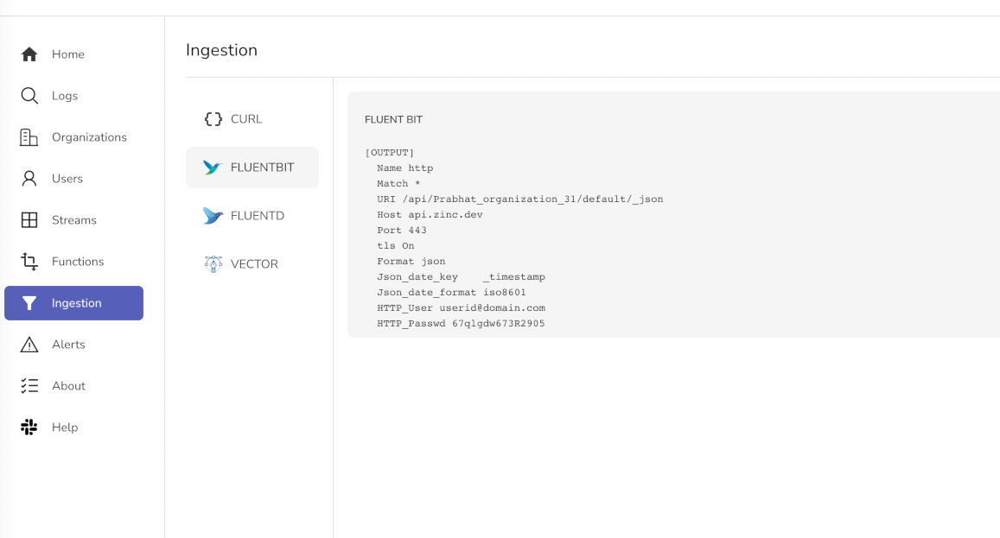
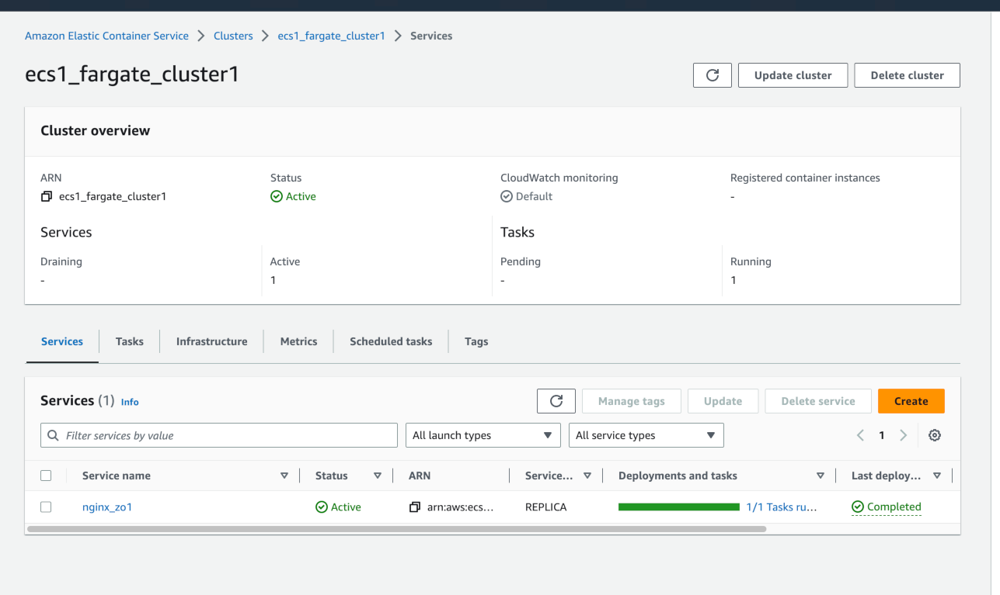
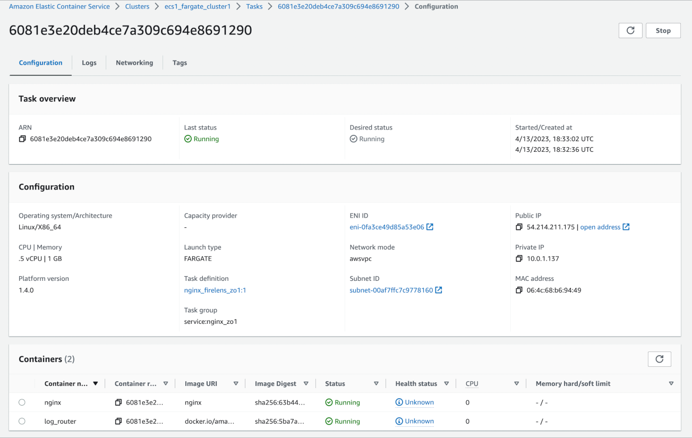
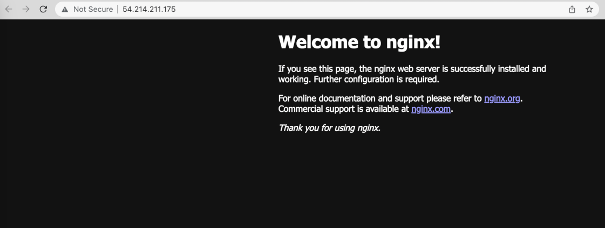

# Ingest logs from Amazon ECS using AWS firelens

## Introduction

In order to send logs from [**`tasks`**](## "An `ECS task` is a collection of on or more containers running as a single unit in ECS. If you are from a kubernetes background then an ECS task is equivalent to a pod") running in ECS (on fargate and ec2 for linux) to ZincObserve, AWS firelens is the recommended mechanism. AWS firelens is a log router for Amazon ECS that sends log data from containers running in ECS tasks to fluentbit (or fluentd) sidecar container which can then send data to wherever fluentbit supports sending data.  A sidecar container is simply an additional container running along side the main container in a task that performs some ancillary services - e.g. collecting logs, keep configuration up to date, etc. We recommend that you use fluentbit instead of fluentd due to its much lower resource requirements.

If you have existing ECS tasks from which you need to send logs to ZincObserve, then you will need to modify their task definition to add fluentbit sidecar. Let's take a look at how to accomplish this.

# Prerequisites

1. A Zinc cloud account or a ZincObserve self hosted setup.
1. A running ECS cluster that supports fargate. If you don't already have one, create one by following the [documentation](https://docs.aws.amazon.com/AmazonECS/latest/userguide/create-cluster-console-v2.html).

We will run our tasks using fargate for this demonstration.

## Get Zinc Cloud / ZincObserve Configuration

Before you can start with setting up the configuration of your ECS task you will need the details of your ZincObserve where you will send the logs. You can either use a self hosted ZincObserve or Zinc Cloud for this. You can get started with Zinc Cloud for free at [https://observe.zinc.dev](https://observe.zinc.dev) that has a generous free tier.

You can find the config details under ingestion/fluentbit



You can use the configuration details from this section in your task definition

## Create ECS task definition

Create the following file and save it as "nginx_firelens_zo_task_def.json"

```json title="ECS task definition - nginx_firelens_zo_task_def.json" linenums="1" hl_lines="4 27 46-56"
{
  "family": "nginx_firelens_zo1",
  "taskRoleArn": "arn:aws:iam::058694856476:role/ecsTaskBasicRole",
  "executionRoleArn": "arn:aws:iam::058694856476:role/ecsTaskExecutionRole",
  "cpu": "512",
  "memory": "1024",
  "requiresCompatibilities": [
    "FARGATE"
  ],
  "networkMode": "awsvpc",
  "containerDefinitions": [
    {
      "name": "log_router",
      "image": "docker.io/amazon/aws-for-fluent-bit:latest",
      "essential": true,
      "firelensConfiguration": {
        "type": "fluentbit",
        "options": {
          "enable-ecs-log-metadata": "true"
        }
      },
      "logConfiguration": {
        "logDriver": "awslogs",
        "options": {
          "awslogs-create-group": "true",
          "awslogs-group": "firelens-container",
          "awslogs-region": "us-west-2",
          "awslogs-stream-prefix": "firelens"
        }
      }
    },
    {
      "name": "nginx",
      "image": "nginx",
      "portMappings": [
        {
          "containerPort": 80
        }
      ],
      "essential": true,
      "environment": [],
      "logConfiguration": {
        "logDriver": "awsfirelens",
        "secretOptions": [],
        "options": {
          "Name": "http",
          "Match": "*",
          "uri": "/api/default/ecs_firelens1/_json",
          "host": "api.zinc.dev",
          "Port": "443",
          "Format": "json",
          "tls": "on",
          "Json_date_key": "_timestamp",
          "Json_date_format": "iso8601",
          "http_User": "userid@domain.com",
          "http_Passwd": "67qlgdw673R2905"
        }
      }
    }
  ]
}
```

`logDriver` in this case is `awsfirelens`. All the logs for nginx container will be sent to fluentbit using `awsfirelens`.

`options` section has [http output plugin](https://docs.fluentbit.io/manual/pipeline/outputs/http) configuration for fluentbit. Configure this section with the values you got from ZincObserve.


Register the task definition using the below command:

```shell
aws ecs register-task-definition --cli-input-json file://nginx_firelens_zo_task_def.json
```


We will also need to provide network configuration when using networkMode as `awsvpc` during service creation. Let's create a json file for that:

```json title="Network configuration - network_config.json" linenums="1" hl_lines="10"
{
  "awsvpcConfiguration": {
    "subnets": [
      "subnet-12345678",
      "subnet-23456789"
    ],
    "securityGroups": [
      "sg-12345678"
    ],
    "assignPublicIp": "ENABLED"
  }
}
```

**Note**: `Do not` set `assignPublicIp` on line `10` as ENABLED for real world scenarios. You do not want to access tasks directly. We are doing this now only for demonstration. You should always either front the services with a load balancer or AWS `Cloud Map`.


## Create ECS service

Now let's create an ECS `service` that will use this task definition. 

Assuming the name of your cluster - `ecs1_fargate_cluster1` run below command:

```shell
aws ecs create-service --cluster ecs1_fargate_cluster1 \
    --service-name nginx_zo1 \
    --task-definition nginx_firelens_zo1 \
    --network-configuration file://network_config.json \
    --desired-count 1 \
    --launch-type "FARGATE"
```

## Verify result

If all goes well, you should see a running service on ECS console:



Now click on the tasks tab. You should see a task running as part of the service:


Now click on the task:




You should see the `Public IP` for the task.

Click `open address`. You should see the following page:




Now head on the ZincObserve / Zinc Cloud and see the logs flowing in there.


## Conclusion

AWS firelens provides an easy way to send ECS container logs to ZincObserve. We configured AWS firelens in few steps to send logs to ZincObserve / Zinc cloud. to easily view and analyze logs.

